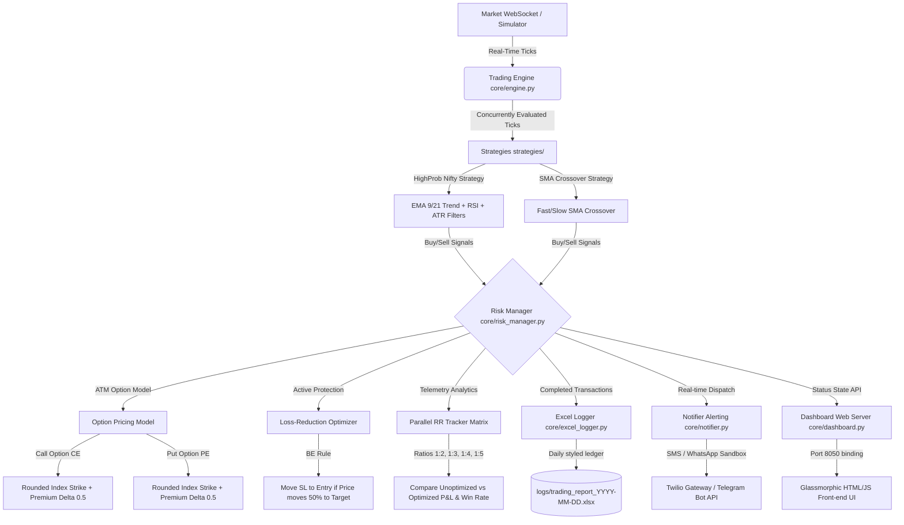

# Automated ATM Options Trading Pipeline & Parallel RR Optimizer

An institutional-grade algorithmic trading pipeline optimized for the Indian Stock Market indices (`NIFTY50`, `BANKNIFTY`). It simulates live unauthenticated data adapters, maps index signals to At-The-Money (ATM) Option contract buying (CE/PE), tracks multiple Risk-Reward ratios in parallel, implements a loss-reduction break-even stop trailing algorithm, and serves a live glassmorphic dashboard on port `8050`.

---

## 1. System Architecture Flowchart



---

## 2. Key System Features

*   **ATM Option Buying Model**: Translates underlying Index BUY/SELL triggers into Call Options (CE) and Put Options (PE) contracts. Striking is rounded to the nearest `50` points for Nifty and `100` points for Bank Nifty. Premium fluctuations are mathematically simulated at a Delta of `0.5` relative to the index.
*   **Loss-Reduction Optimizer**: Employs a dynamic **Break-Even Stop Loss** trigger. If a trade moves 50% of the way toward the target price, the stop loss is instantly relocated to the entry price. If the market reverses, the position exits with ₹0/near-zero loss, protecting the option premium.
*   **Parallel RR Matrix Tracker**: Executes 4 virtual setups concurrently for every trade signal (Ratios 1:2, 1:3, 1:4, 1:5) in both unoptimized and optimized formats. This allows instant comparison of which configuration yields the highest probability and cumulative P&L.
*   **Maximum Favorable Excursion (MFE)**: Measures and logs the exact peak point run of each trade from its entry base to evaluate the maximum profit potential.
*   **Comprehensive Audit Ledgers**: Generates a daily 13-column Excel ledger (`logs/trading_report_YYYY-MM-DD.xlsx`) containing transaction times, instruments, premiums, peak runs, and P&L, styled with conditional formatting.

---

## 3. Configuration Guide

System parameters are defined in `config.yaml`:
```yaml
execution_mode: "PAPER"  # PAPER, BACKTEST, or LIVE
active_broker: "paper"   # paper, dhan, binance

broker:
  paper:
    tick_interval_seconds: 0.1
    symbols:
      - "NIFTY50"
      - "BANKNIFTY"

risk:
  risk_reward_ratio: 1.5
  risk_percentage_per_trade: 0.005 # 0.5% index risk
  default_qty: 25                  # Nifty contract lot size
```

---

## 4. 24/7 Online Deployment Manual (Linux VPS)

To keep the dashboard updated and running continuously online even when you close your computer, you can host the pipeline on any Linux Virtual Private Server (VPS) (e.g., AWS EC2, GCP Compute Engine, DigitalOcean, or Hetzner).

### Step 1: Clone and Configure
Clone your repository onto the cloud server:
```bash
git clone https://github.com/Anshbhardwaj29/Finance-data-pipeline.git
cd Finance-data-pipeline
```

### Step 2: Automated Deployment Setup
The project includes a `deploy.sh` script that automates package installation, virtual environment configuration, systemd service creation, and ufw firewall permission rules.
Simply run:
```bash
chmod +x deploy.sh
./deploy.sh
```

### Step 3: Service Management (24/7 background execution)
The pipeline is managed by the Linux **Systemd** daemon which ensures it starts automatically on system reboot and auto-restarts if a strategy encounters a crash:

*   **View Real-Time Logs**:
    ```bash
    journalctl -u trading_pipeline -f
    ```
*   **Stop the Pipeline**:
    ```bash
    sudo systemctl stop trading_pipeline
    ```
*   **Start the Pipeline**:
    ```bash
    sudo systemctl start trading_pipeline
    ```
*   **Restart the Pipeline**:
    ```bash
    sudo systemctl restart trading_pipeline
    ```

### Step 4: Secure Remote Access to Dashboard
By default, the dashboard runs on `http://<your_vps_ip>:8050`. You have three options to access it:

1.  **Direct IP Access**: The `deploy.sh` opens port `8050` on the firewall. You can access it directly at `http://<VPS_IP>:8050`.
2.  **SSH Tunneling (Most Secure)**: Keep port `8050` closed to the public internet on the VPS. Forward it securely to your local machine by running this command on your personal laptop terminal:
    ```bash
    ssh -N -L 8050:localhost:8050 user@your_vps_ip
    ```
    Now, open `http://localhost:8050` on your laptop browser.
3.  **Cloudflare Tunnels (Recommended for Custom Domain)**: Use Cloudflare's free secure agent to tunnel traffic to a subdomain (e.g. `desk.myportfolio.com`) without opening public ports.
